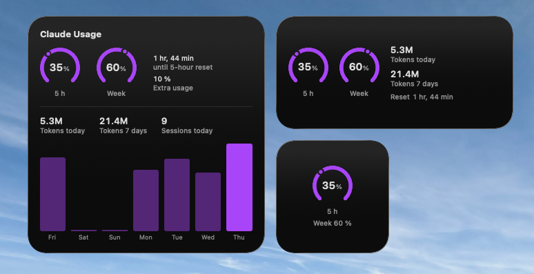
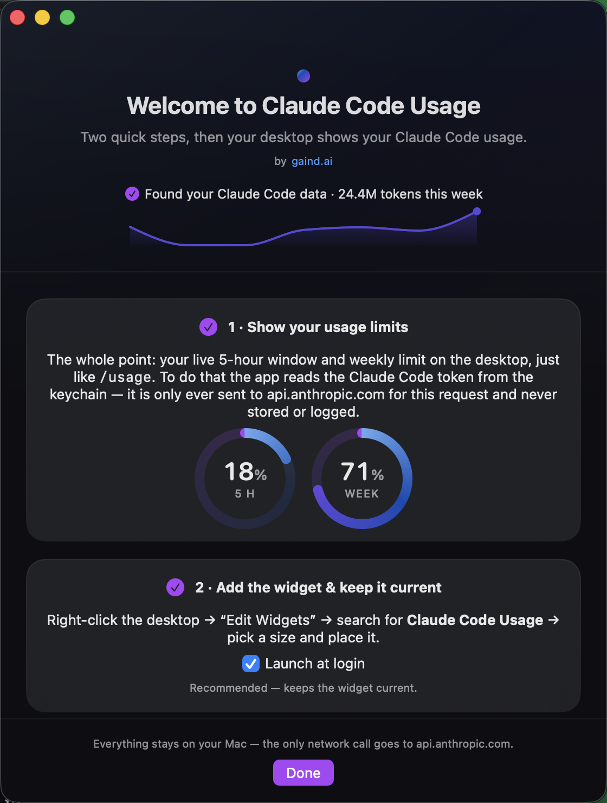
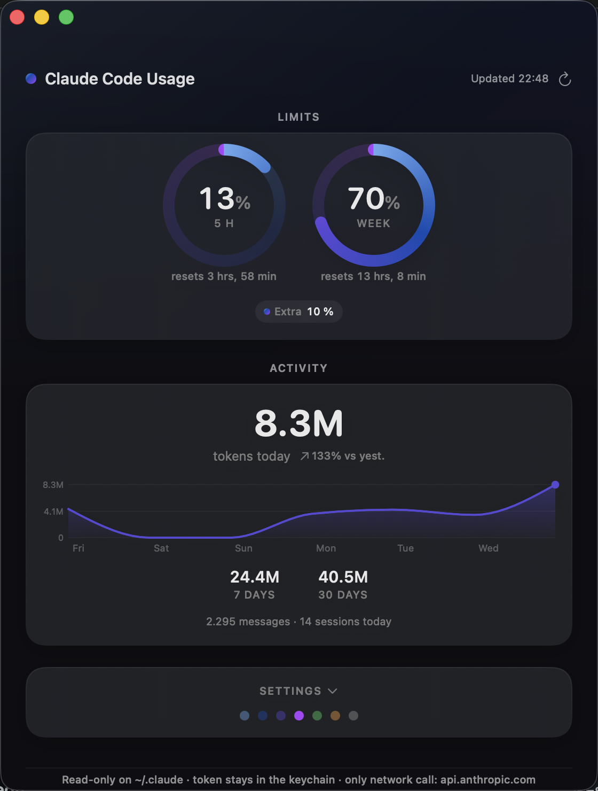

# Claude Code Usage — macOS desktop widget for Claude Code

A desktop widget that shows your Claude Code usage: the 5-hour window and
weekly limit (exactly what `/usage` shows in the CLI), plus token consumption
and activity from your local session logs with a 7-day history.

Everything stays on your Mac. No accounts, no third-party servers, no manual
token handling — the widget reuses the login that Claude Code already has.



## Disclaimer

This is an independent, community-built tool — **not affiliated with, endorsed
by, or supported by Anthropic**. The limits display queries an **undocumented**
Anthropic endpoint (`api.anthropic.com/api/oauth/usage`, the same one the
`/usage` command uses) using your own Claude Code OAuth token, and identifies
itself with a `claude-code` user agent. Anthropic may change or remove that
endpoint at any time, which would simply hide the limits (local token/activity
data keeps working). You run this against your own Anthropic account, at your
own discretion. "Claude" and "Claude Code" are trademarks of Anthropic.

## Requirements

- macOS 14 (Sonoma) or newer
- [Xcode](https://apps.apple.com/app/xcode/id497799835) (free, multi-GB
  download) — you build the app from source yourself; nobody has to trust a
  stranger's binary. Open it once to accept the license, then select it with
  `sudo xcode-select -s /Applications/Xcode.app`.
- [XcodeGen](https://github.com/yonaskolb/XcodeGen): `brew install xcodegen`
- Claude Code installed and logged in (that's what the widget reports on)

## Install

Once Xcode and XcodeGen are in place, the build itself takes 1–2 minutes:

```sh
git clone https://github.com/gaindai/claude-usage-widget.git
cd claude-usage-widget
./install.sh
```

To **update** later: `git pull && ./install.sh` (it stops the running app and
reinstalls in place; your settings and keychain grant are preserved).

That's it. The app launches and walks you through two onboarding steps —
it finds your `~/.claude` data automatically and shows first numbers right
away, no permissions needed:

1. **Show your usage limits** — one click, then macOS asks for keychain
   access: choose **"Always Allow"**. This is the heart of the app: your live
   5-hour window and weekly limit, like `/usage`, but on the desktop. (If you
   skip it, the widget still shows your local token usage.)
2. **Add the widget** — right-click the desktop → "Edit Widgets" →
   **Claude Code Usage** → pick a size. Enable "Launch at login" so the
   widget stays current.

<p>
  
  
</p>

## The app window

Launching the app from Applications opens the status window (the app appears
in the Dock while the window is open and returns to being an invisible
background agent when you close it):

- **Limits** — two gauge rings for the 5-hour window and the week, with reset
  countdowns and, when applicable, Opus/Extra-usage chips.
- **Activity** — tokens today with a day-over-day delta, a 7-day trend line
  with a token scale and weekday axis, 7/30-day totals, messages and sessions.
- **Settings** (collapsible) — accent color swatches, "Launch at login",
  the keychain toggle for limits, and a way back to the onboarding.
- If no widget is placed on the desktop yet, the window shows a hint with
  the exact steps — it disappears automatically once a widget is added.

The **accent color** applies uniformly to the app and the widget gauges/bars.
Picking one of the gaind brand colors (Cyan, Blue, Purple, Magenta) renders
the full brand gradient in the rings and trend line; Green, Orange and
Graphite stay single-color. The color is chosen in the app rather than via
macOS's widget configuration, because that configuration is unreliable for
self-built, locally signed widgets.

The background app refreshes every 3 minutes and requests widget reloads only
when displayed values actually change.

## What the numbers mean

| Display | Source | Notes |
|---|---|---|
| 5-hour window / weekly limit (%) | Anthropic usage endpoint (same source as `/usage`) | exact, server-side |
| Tokens (today / 7 days / 30 days) | local session logs (`~/.claude/projects`) | **input + output tokens, excluding cache** — the same definition as "Total tokens" in Claude Code's `/usage` statistics, verified empirically against it |
| Messages / sessions | local session logs | deduplicated assistant responses; distinct sessions per day |

Token counts deliberately exclude prompt-cache reads/writes (which dwarf real
usage by ~50×) and sub-agent sidechains, so the widget matches the number you
see in Claude Code itself.

## Security model

Designed so that you can run it without trusting anyone — including us:

- **No secret ever leaves the keychain unnecessarily.** The Claude Code OAuth
  token is read at runtime from the macOS keychain, held in memory only, used
  solely as the auth header for the usage request to `api.anthropic.com`, and
  never written to disk or logged.
- **Exactly one network destination:** `api.anthropic.com` (HTTPS, ATS
  enforced, ephemeral session without cookie/cache persistence). No telemetry,
  no analytics, no third-party servers.
- **Background refreshes never trigger keychain dialogs.** Automatic fetches
  read the token with UI interaction disabled; if macOS would need to ask
  (e.g. after Claude Code rotated its token), the app quietly shows a
  "Reconnect" button instead of popping a password prompt at you.
- **`~/.claude` is only ever read**, never written.
- **The widget itself is sandboxed** with a read-only exception scoped to a
  single directory (`~/Library/Application Support/ClaudeUsage/`), where it
  reads the aggregate snapshot (`snapshot.json`, mode 0600) — numbers only,
  never prompts, transcripts, or tokens.
- **Reviewable build path:** the Xcode project is generated from `project.yml`
  on every build (no opaque pre-generated project file in the repo), the app
  has zero third-party dependencies, and Hardened Runtime is enabled (blocks
  debugger attachment and library injection into the process that touches the
  token).
- **Everyone builds from source.** `install.sh` creates a one-time self-signed
  local certificate (no Apple Developer account needed) and signs with it, so
  the keychain "Always Allow" grant stays valid across rebuilds instead of
  re-prompting on every update. Locally built apps carry no Gatekeeper
  quarantine.
- Everyone sees **their own usage only**. (A central team dashboard would be
  possible via Claude Code's OpenTelemetry export — deliberately out of scope.)

Known, deliberate trade-offs:

- The limits endpoint (`/api/oauth/usage`) is **not officially documented** by
  Anthropic. The request identifies itself with a `claude-code` user agent,
  which the community-established integrations use. If the endpoint changes,
  the widget degrades gracefully to local data until this repo catches up.
- The background app itself is not sandboxed (it needs read access to
  `~/.claude` and the keychain item). Sandboxing it with scoped exceptions is
  on the roadmap.

See [SECURITY.md](SECURITY.md) for the full threat model and how to report
vulnerabilities.

## Troubleshooting

- **"Xcode is required"** — install Xcode from the App Store, open it once,
  then `sudo xcode-select -s /Applications/Xcode.app`.
- **Keychain password prompt** — appears only when you explicitly click
  *Connect*/*Reconnect*, never from background refreshes. Choose
  **"Always Allow"** and it won't ask again, including after future updates
  (the app is signed with a stable local certificate, so the grant survives
  rebuilds). If you build with a tool other than `install.sh` that
  ad-hoc-signs, the prompt would return on every build — use `install.sh`.
- **"Limits paused — reconnect"** in the app — Claude Code rotated its token
  and macOS reset the keychain grant. Click *Reconnect* once (and
  "Always Allow"); the rings come back immediately.
- **Accidentally denied the keychain dialog** — the app stops asking (by
  design, no prompt loops). Open the app → Settings → re-enable
  "Fetch session/weekly limits (keychain)".
- **"Token expired" in the app** — run `claude` once in a terminal (Claude
  Code refreshes its own token); the limits recover within minutes.
- **Widget shows "paused"** — the background app hasn't written data for
  over 45 minutes. Launch it once and enable "Launch at login".
- **Widget values lag a few minutes behind** — normal: macOS budgets widget
  refreshes for background apps. The app only requests reloads when displayed
  values actually change.
- **Limits disappeared from the widget** — no successful limit fetch for 30+
  minutes (e.g. Claude Code logged out). Local data keeps working; log back in
  and the limits return.

## Architecture

Two targets, generated from `project.yml` via XcodeGen:

- **ClaudeUsage** — background app (`LSUIElement`, not sandboxed):
  - `UsageCollector` (an actor — serialized, race-free) parses the JSONL
    session logs read-only with per-file mtime/size caching,
  - `RateLimitClient` polls the usage endpoint at most every 180 s with the
    keychain token; a redirect guard pins the auth header to
    `api.anthropic.com`,
  - `KeychainTokenProvider` reads the token — with keychain UI suppressed
    for automatic fetches, so background polling can never spawn dialogs,
  - `SnapshotStore` writes the aggregate snapshot atomically (0600),
  - an App-Nap-resistant `NSBackgroundActivityScheduler` drives the 3-minute
    refresh cycle and requests widget reloads only when visible values change,
  - the SwiftUI app windows (`StatusView`, `OnboardingView`) share a small
    design system (`DesignSystem.swift`: brand-gradient ring gauges, cards,
    accent bridge) plus a Swift-Charts trend line (`Sparkline.swift`).
- **ClaudeUsageWidget** — sandboxed widget extension with a read-only
  temporary exception for the snapshot directory. The timeline pre-renders
  future state transitions (stale badge, 5-hour reset) so they appear on time
  without consuming WidgetKit's reload budget. The widget deliberately stays
  dependency-free (no Swift Charts).

> Note: the bundle on disk is named `Claude Usage.app` (stable internal
> identifiers keep your keychain grant, login item and placed widgets intact
> across updates); everywhere in the UI the app calls itself
> **Claude Code Usage**.

## Uninstall

```sh
# 1. Quit and remove the app (the bundle keeps the internal name)
pkill -x "Claude Usage" 2>/dev/null
rm -rf "/Applications/Claude Usage.app"   # or ~/Applications/Claude Usage.app
# 2. Remove its data and the local signing certificate
rm -rf ~/Library/Application\ Support/ClaudeUsage
security delete-certificate -c "Claude Usage Local Signing" 2>/dev/null
```

Then remove the widget from the desktop and disable the login item in System
Settings → General → Login Items, if you enabled it.

## License & contributions

MIT — see [LICENSE](LICENSE). Built by [gaind.ai](https://gaind.ai). Issues and
PRs welcome — especially for localization (the in-code comments are still
German), sandboxing the main app, and additional widget layouts.
